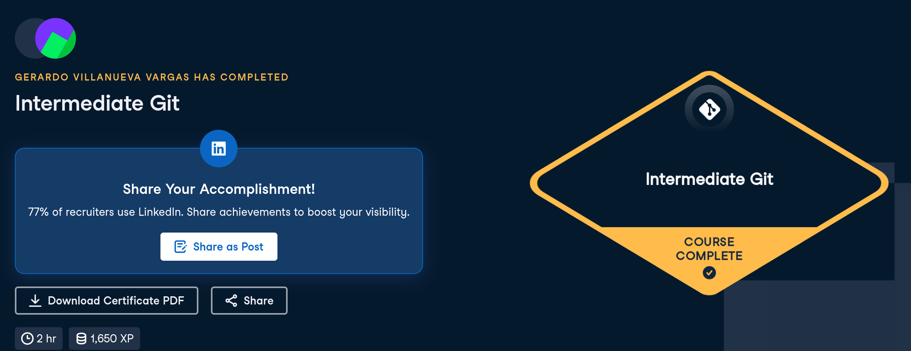

# Certificaciones de Git

Llena este archivo en **tu copia**, dentro de `estudiantes/<tu-login>/github/`.

## Quién soy

- Nombre: Gerardo Villanueva Vargas
- Usuario de GitHub:geraVillV
- Correo con el que entraste a DataCamp:gvillan7@itam.mx

## Introduction to Git

Fecha en que lo terminaste:10 de Septiembre, 2026.

## Intermediate Git

Fecha en que lo terminaste:16 de Septiembre, 2026.

## Una cosa que aprendiste y no sabías

Creo que haciendo el curso intemedio de git me queda más claro porque se sigue el flujo que se sigue. Ademas, ya entiendo mejor los comandos que tengo que hacer en github. Por ultimo en clase no me habia quedado muy claro lo de los conflictos que pueden existir en git con los pulls y al trabjar en main y asi, y ya con el curso entiendo mejor las razones de los conflictos.

